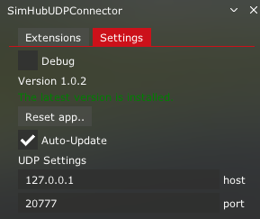
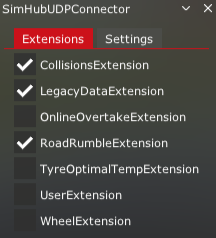

# SimHub UDPConnector plugin creations repository
## This is the official repository for scripts and profiles that uses the SimHub plugin SimHub UDPConnector

*If you want to share your creations PR are welcome.*

The SimHub UDPConnector plugin is available here for free : [overtake.gg](https://www.overtake.gg/downloads/simhub-udpconnector-assetto-app-example-with-additional-datas.74471/)

> [!NOTE]
> The plugin is not limited to Assetto Corsa, it is agnostic to the sim used, you can send data from whatever sources as long as it's simple json (key/value) sent via UDP on the port configured in the plugin settings. 

### Assetto Corsa ###
The only app you need is SimHubUDPConnector.lua, you can drag and drop the zip archive directly into ContentManager to install or update it. Once installed you don't need to update it manually it should update automatically when an update is available. 

> [!NOTE]
> You can force an update by clicking on the "Reset app" button in the app settings.  
  

By default it will send [additional data](#default_data) to SimHub and enable Collisions effect and Road Rumble (with road textures) effect for ShakeIt (motors and bass shakers).  
If you need to send other data copy the file extensions/SampleUserExtension.lua and rename the copy to UserExtension.lua and add your custom code there (update function).  
To activate the extension open the app window in assetto and check the extension you want to activate :

  

If you made a great addition that you want to share with others you can create your own Extension (take a look at the folder extensions for examples) and submit a PR.  

> [!NOTE]
> Don't forget to activate your extension, it will be automatically detected as long as it's in the extension folder but deactivated by default.

If you need support with the plugin or the apps feel free to join our [Discord](https://discord.gg/CftwCDXEvv) 

<a name="default-data">Default data sent by the Assetto lua app :</a> 
- Ambient Temperature
- Autoclutch
- Brake
- Car Direction
- Car Force Feedback
- Clutch
- Collision PositionX
- Collision PositionY
- Collision PositionZ
- Collided With Id
- Collided With (None, Track, DriverName)
- CSP Version
- Differential Preload
- Differenial Coast
- Differential Power
- Drift Points
- Drift Combo Counter
- Drift Instant Points
- Drift Bonus On
- Drift Is Drift Valid
- Extra A
- Extra B
- Extra C
- Extra D
- Extra E
- Extra F
- Extra G
- FPS
- Fuel Map
- Handbrake
- Hazard Lights
- Headlights Active
- High Beam
- Ingame Hours
- Ingame Minutes
- Is In Pitlane
- Is In Pit
- KERS Charge
- KERS Charging
- KERS Current KJ
- KERS Load
- KERS Max KJ
- KERSPresent
- Light Options
- Limiter On
- Limiter Speed
- MGUH Charging Batteries
- MGUK Delivery
- MGUK Delivery Count
- MGUK Delivery Name
- MGUK Recovery
- Oil Pressure
- Oil Temperature
- Steer
- Steer Lock
- TC2
- Throttle
- Turn/Corner Name
- Turning Left Lights
- Turning Right Lights
- Water Temperature
- Wind Direction Deg
- Wind Speed Kmh
- Wiper Modes
- Wiper Mode
- Wiper Progress
- Wiper Selected Mode
- Wiper Speed
- Wheel FL Surface
- Wheel FL Surface Vibration Gain
- Wheel FL Surface Vibration Length 
- Wheel FL Tyre Optimum Temperature
- Wheel FL Tyre Carcass Temperature
- Wheel FL Slip Angle
- Wheel FL Speed Difference
- Wheel FR Surface
- Wheel FR Surface Vibration Gain
- Wheel FR Surface Vibration Length 
- Wheel FR Tyre Optimum Temperature
- Wheel FR Tyre Carcass Temperature
- Wheel FR Slip Angle
- Wheel FR Speed Difference
- Wheel RL Surface
- Wheel RL Surface Vibration Gain
- Wheel RL Surface Vibration Length 
- Wheel RL Tyre Optimum Temperature
- Wheel RL Tyre Carcass Temperature
- Wheel RL Slip Angle
- Wheel RL Speed Difference
- Wheel RR Surface
- Wheel RR Surface Vibration Gain
- Wheel RR Surface Vibration Length 
- Wheel RR Tyre Optimum Temperature
- Wheel RR Tyre Carcass Temperature
- Wheel RR Slip Angle
- Wheel RR Speed Difference